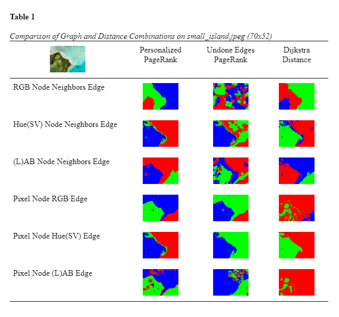
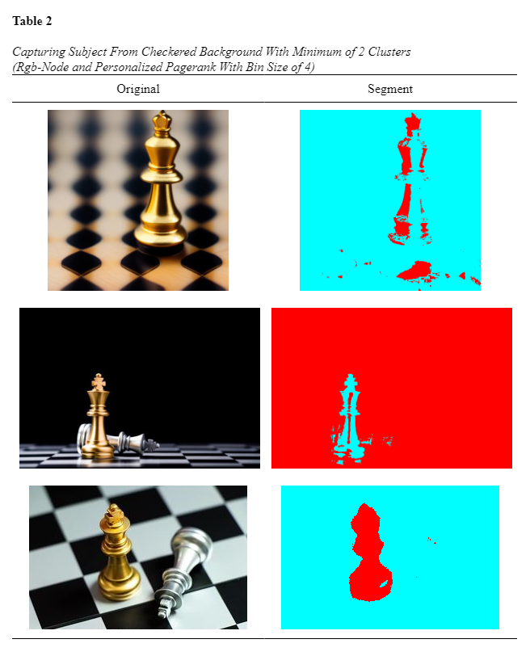

# Image Segmentation Through Application of Pagerank Graph-Based Kmeans Clustering

Applies graph-based k-means, which uses pagerank to choose the centroids of node clusters, and a custom distance assign nodes to a centroid, to segment images in k number of partitions.

## Method

The graph representation of the images are constructed under two methods. 

First, Color-Node uses each unique color channel value as a node with directed edges of 1 to other nodes which 4-neighbor the color in the image.

Second, Color-Edge uses each pixel in the image as a node with directed edges to every other node weighted to similarity by color channel vector distance. 
 
The initial color spaces tested are RGB, hue from HSV, and ab from Lab.

In addition to the Dijkstra Algorithm to assign each node to one of the respective centroids, the Personalized Pagerank (RWR) Algorithm with each centroid as the target uses the bidirectional importance of each node to the centroid to achieve assignment.

A new pagerank algorithm termed “Undone Edges Pagerank” is also tested in place of the Dijkstra Algorithm. For each previous cluster, the graph of nodes are partitioned to cluster and non-cluster nodes, the outward directing edges of each non-cluster node are removed. Standard Pagerank is performed under the presumption that non-cluster nodes will rank higher if they are important to the cluster node subgraph.

## Usage

*Example Usage*
```
$python segment --input image.PNG --output image_out.PNG --clusters 3 --graph_type 1 --distance_algorithm 1 --bin_size 2
```

## Requirements

- numpy
- python-opencv

## Example Results



